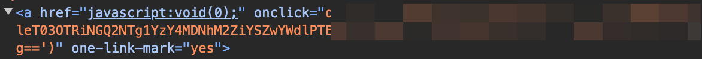
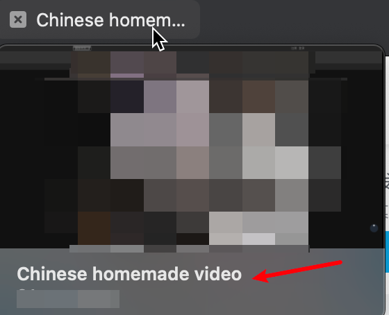

# 91Fix
## 开发背景
今天逛91，发现一部分视频预览链接href中没有了视频详情页链接，因此无法直接右键后台打开新标签页；并且视频详情页title也不再是视频标题了，这对于爱好添加到浏览器收藏夹的老哥们极度不友好。  
看了一下源码，也换了几台机器，都发现了这样的问题。  
暂时不确定是否是91的bug还是为了日后的反爬提前做测试。
  

**为了恢复之前刷91的爽度，写了个油猴插件用来修复这两个问题**

## 使用方法
把`91fix.js`添加到油猴插件即可。